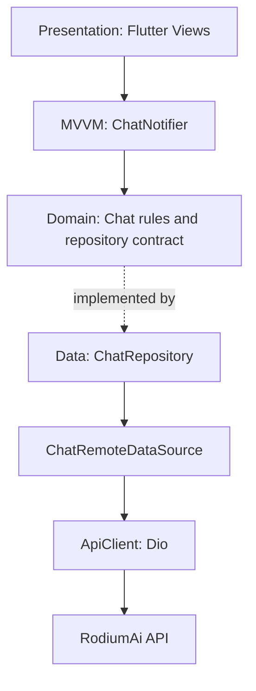
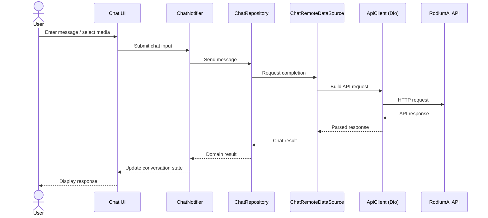

<div align="center">

# ChatRodi

**RodiumAi multimodal BYOK chatbot** built with Flutter

A focused AI chat experience for text, image, and video workflows, powered by the RodiumAi API and user-managed credentials.

[](https://flutter.dev/)
[](https://dart.dev/)
[](https://riverpod.dev/)
[](https://supabase.com/)
[](https://pub.dev/packages/dio)

</div>

## Overview

ChatRodi is a multimodal chatbot with BYOK (bring your own key) credentials. It connects to the RodiumAi API for chat and media workflows. The Flutter app uses Clean Architecture, with MVVM and Riverpod organizing presentation state and user interactions.

## Architecture

| Layer | Responsibilities |
| --- | --- |
| **Presentation** | Flutter screens and widgets display conversations and accept user input. `ChatNotifier` exposes chat state and coordinates presentation actions using Riverpod. |
| **Domain** | Chat entities, repository contracts, and use-case/business rules independent from Flutter and network implementation details. |
| **Data** | Repository implementations, data sources, API request/response mapping, and integration with RodiumAi. |



Riverpod provides dependency and state management. The repository boundary keeps domain logic independent from Dio and the remote API.

## Request flow



## Project structure

The Flutter application lives in `chat_rodi/`. This tree summarizes its top-level layout and architectural responsibilities; component names in the request flow are shown as logical roles.

```text
ChatRodi/
├── README.md
└── chat_rodi/
    ├── .env.example
    ├── pubspec.yaml
    └── lib/
        ├── main.dart
        ├── core/       # Shared infrastructure and application-wide concerns
        └── features/   # Feature modules, including chat
            └── chat/
                ├── presentation/  # Views, widgets, ChatNotifier (MVVM + Riverpod)
                ├── domain/        # Entities, repository contract, business rules
                └── data/          # ChatRepository, remote data source, DTOs
```

## Tech stack

| Area | Technology |
| --- | --- |
| Mobile framework | Flutter / Dart |
| State management | Riverpod (`flutter_riverpod`) |
| Architecture | Clean Architecture, MVVM |
| HTTP client | Dio |
| API | RodiumAi API (`/v1`) |
| Backend SDK | Supabase Flutter (`supabase_flutter`) |
| Environment configuration | `flutter_dotenv` |
| Credential storage | `flutter_secure_storage` |
| Routing | `go_router` |
| Media input | `image_picker`, `file_picker` |
| Typography | `google_fonts` |

## Brand palette

The README uses **Deep Orange (`#FF6600`)** as its documentation accent. The app palette below reflects the existing RodiumAi UI design tokens.

| Swatch | Design token | Hex | Intended use |
| --- | --- | --- | --- |
|  | README Deep Orange | `#FF6600` | Badges and documentation highlights |
|  | Rodium Emerald | `#00C9A7` | Accent, primary actions, and success states |
|  | Rodium Deep Slate | `#0F172A` | Dark backgrounds and navigation |
|  | Rodium Surface | `#1E293B` | Cards, panels, and message surfaces |
|  | Rodium Text | `#F8FAFC` | Primary text and headings |

## Getting started

### Requirements

- Flutter SDK compatible with the project's Dart SDK constraint (`^3.13.3`)
- A RodiumAi API key

### Configure environment

1. Enter the app directory:

   ```bash
   cd chat_rodi
   ```

2. Create a local `.env` file from the example:

   ```bash
   cp .env.example .env
   ```

3. Add your configuration and API key to `.env`:

   ```dotenv
   RODIUM_BASE_URL=https://api.rodiumai.io/v1/
   RODIUM_API_KEY=your_api_key_here
   RODIUM_CHAT_ENDPOINT=chat/completions
   RODIUM_IMAGE_ENDPOINT=images/generations
   RODIUM_VIDEO_ENDPOINT=videos/generations
   RODIUM_MODELS_ENDPOINT=models
   ```

   Keep the trailing slash in `RODIUM_BASE_URL` (`/v1/`). Do not commit a real API key or other secrets.

### Install and run

```bash
flutter pub get
flutter run
```

## License

Proprietary. All rights reserved by **Justin BINA**.
