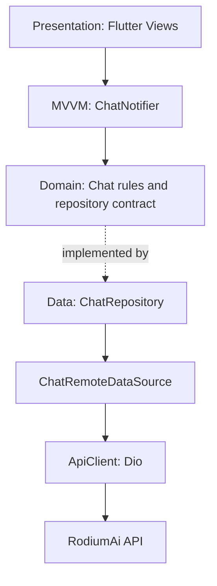
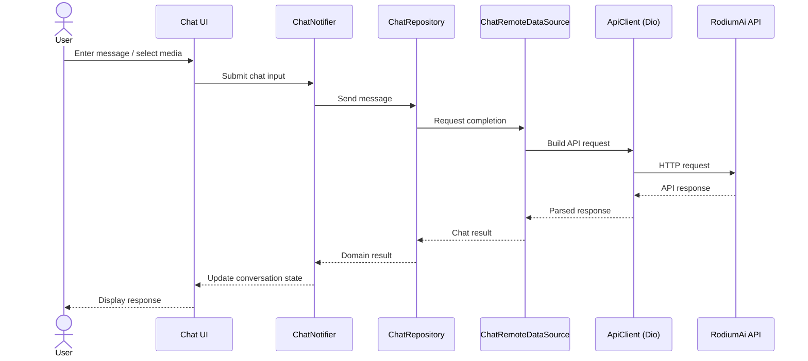

# ChatRodi

**RodiumAi multimodal BYOK chatbot** built with Flutter. ChatRodi provides an AI chat experience powered by the RodiumAi API, with user-managed API credentials and support for text, image, and video workflows.

## Architecture Overview

ChatRodi follows Clean Architecture to keep UI concerns, business rules, and external data access separated. MVVM and Riverpod organize presentation state and user interactions.

| Layer | Responsibilities |
| --- | --- |
| **Presentation** | Flutter screens and widgets display conversations and accept user input. `ChatNotifier` exposes chat state and coordinates presentation actions using Riverpod. |
| **Domain** | Chat entities, repository contracts, and use-case/business rules independent of Flutter and network implementation details. |
| **Data** | Repository implementations, data sources, API request/response mapping, and integration with the RodiumAi service. |



Riverpod provides dependency/state management, while the repository boundary keeps the domain layer independent from Dio and the remote API.

## Project Structure

The repository contains the Flutter application under `chat_rodi/`. The following tree summarizes the existing top-level structure and the architectural responsibilities described above; component names in the request flow are shown as logical roles.

```text
ChatRodi/
├── README.md
└── chat_rodi/
    ├── .env.example
    ├── pubspec.yaml
    └── lib/
        ├── main.dart
        ├── core/       # Shared infrastructure and application-wide concerns
        └── features/   # Feature modules, including chat
            └── chat/
                ├── presentation/  # Views, widgets, ChatNotifier (MVVM + Riverpod)
                ├── domain/        # Entities, repository contract, business rules
                └── data/          # ChatRepository, remote data source, DTOs
```

## Data and Request Flow



## Tech Stack

| Area | Technology |
| --- | --- |
| Mobile framework | Flutter / Dart |
| State management | Riverpod (`flutter_riverpod`) |
| Architecture | Clean Architecture, MVVM |
| HTTP client | Dio |
| API | RodiumAi API (`/v1`) |
| Environment configuration | `flutter_dotenv` |
| Credential storage | `flutter_secure_storage` |
| Routing | `go_router` |
| Media input | `image_picker`, `file_picker` |
| Typography | `google_fonts` |

## Branding and Styling

ChatRodi uses a dark, high-contrast interface with RodiumAi Emerald as its accent color.

| Design token | Hex value | Intended use |
| --- | --- | --- |
| Rodium Emerald | `#00C9A7` | Accent, primary actions, and success states |
| Rodium Deep Slate | `#0F172A` | Dark backgrounds and navigation |
| Rodium Surface | `#1E293B` | Cards, panels, and message surfaces |
| Rodium Text | `#F8FAFC` | Primary text and headings |

## Setup

### Requirements

- Flutter SDK compatible with the project's Dart SDK constraint (`^3.13.3`)
- A RodiumAi API key

### Configure environment

1. From the repository root, enter the app directory:

   ```bash
   cd chat_rodi
   ```

2. Create a local `.env` file from the example:

   ```bash
   cp .env.example .env
   ```

3. Add your configuration and API key to `.env`:

   ```dotenv
   RODIUM_BASE_URL=https://api.rodiumai.io/v1/
   RODIUM_API_KEY=your_api_key_here
   RODIUM_CHAT_ENDPOINT=chat/completions
   RODIUM_IMAGE_ENDPOINT=images/generations
   RODIUM_VIDEO_ENDPOINT=videos/generations
   RODIUM_MODELS_ENDPOINT=models
   ```

   Keep the trailing slash in `RODIUM_BASE_URL` (`/v1/`). Do not commit a real API key or other secrets.

### Install and run

```bash
flutter pub get
flutter run
```

## License

Proprietary. All rights reserved by **Justin BINA**.
