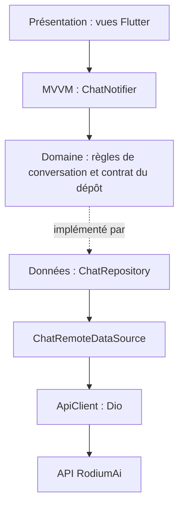
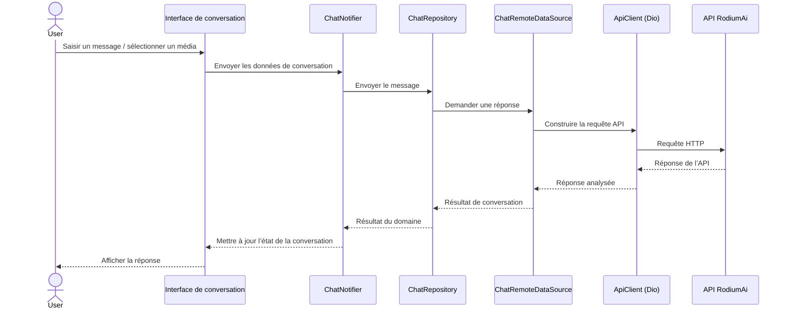

<div align="center">

# ChatRodi

**Auteur : Justin BINA**

**Chatbot multimodal RodiumAi avec BYOK** développé avec Flutter

Une expérience de discussion IA dédiée aux flux de travail utilisant du texte, des images et des vidéos, propulsée par l’API RodiumAi et des identifiants gérés par l’utilisateur.

[](https://flutter.dev/)
[](https://dart.dev/)
[](https://riverpod.dev/)
[](https://supabase.com/)
[](https://pub.dev/packages/dio)

</div>

## Présentation

ChatRodi est un chatbot multimodal utilisant le modèle BYOK (« apportez votre propre clé »). Il se connecte à l’API RodiumAi pour les conversations et les flux de travail multimédias. L’application Flutter repose sur la Clean Architecture, avec MVVM et Riverpod pour organiser l’état de présentation et les interactions utilisateur.

## Architecture

| Couche | Responsabilités |
| --- | --- |
| **Présentation** | Les écrans et widgets Flutter affichent les conversations et recueillent les saisies utilisateur. `ChatNotifier` expose l’état de la conversation et coordonne les actions de présentation à l’aide de Riverpod. |
| **Domaine** | Entités de conversation, contrats de dépôt et cas d’utilisation/règles métier indépendants de Flutter et des détails d’implémentation réseau. |
| **Données** | Implémentations des dépôts, sources de données, correspondance des requêtes/réponses API et intégration avec RodiumAi. |



Riverpod assure la gestion des dépendances et de l’état. La séparation par dépôt maintient la logique métier indépendante de Dio et de l’API distante.

## Flux d’une requête



## Structure du projet

L’application Flutter se trouve dans `chat_rodi/`. Cette arborescence résume sa structure de premier niveau et les responsabilités architecturales ; les composants du flux de requête représentent des rôles logiques.

```text
ChatRodi/
├── README.md
└── chat_rodi/
    ├── .env.example
    ├── pubspec.yaml
    └── lib/
        ├── main.dart
        ├── core/       # Infrastructure partagée et éléments communs à l’application
        └── features/   # Modules fonctionnels, dont la conversation
            └── chat/
                ├── presentation/  # Vues, widgets, ChatNotifier (MVVM + Riverpod)
                ├── domain/        # Entités, contrat du dépôt, règles métier
                └── data/          # ChatRepository, source de données distante, DTO
```

## Technologies utilisées

| Domaine | Technologie |
| --- | --- |
| Framework mobile | Flutter / Dart |
| Gestion de l’état | Riverpod (`flutter_riverpod`) |
| Architecture | Clean Architecture, MVVM |
| Client HTTP | Dio |
| API | API RodiumAi (`/v1`) |
| SDK backend | Supabase Flutter (`supabase_flutter`) |
| Configuration de l’environnement | `flutter_dotenv` |
| Stockage des identifiants | `flutter_secure_storage` |
| Routage | `go_router` |
| Entrée multimédia | `image_picker`, `file_picker` |
| Typographie | `google_fonts` |

## Palette de la marque

Le README utilise l’**orange profond (`#FF6600`)** comme couleur d’accent. La palette de l’application ci-dessous reprend les jetons de conception de l’interface RodiumAi existante.

| Nuancier | Jeton de conception | Hexadécimal | Utilisation prévue |
| --- | --- | --- | --- |
|  | Orange profond du README | `#FF6600` | Badges et mises en évidence de la documentation |
|  | Émeraude Rodium | `#00C9A7` | Accent, actions principales et états de réussite |
|  | Ardoise profonde Rodium | `#0F172A` | Arrière-plans sombres et navigation |
|  | Surface Rodium | `#1E293B` | Cartes, panneaux et surfaces des messages |
|  | Texte Rodium | `#F8FAFC` | Texte principal et titres |

## Démarrage

### Prérequis

- SDK Flutter compatible avec la contrainte de version Dart du projet (`^3.13.3`)
- Une clé API RodiumAi

### Configuration de l’environnement

1. Accédez au répertoire de l’application :

   ```bash
   cd chat_rodi
   ```

2. Créez un fichier `.env` local à partir de l’exemple :

   ```bash
   cp .env.example .env
   ```

3. Ajoutez votre configuration et votre clé API dans `.env` :

   ```dotenv
   RODIUM_BASE_URL=https://api.rodiumai.io/v1/
   RODIUM_API_KEY=your_api_key_here
   RODIUM_CHAT_ENDPOINT=chat/completions
   RODIUM_IMAGE_ENDPOINT=images/generations
   RODIUM_VIDEO_ENDPOINT=videos/generations
   RODIUM_MODELS_ENDPOINT=models
   ```

   Conservez la barre oblique finale dans `RODIUM_BASE_URL` (`/v1/`). Ne validez jamais une véritable clé API ni aucun autre secret dans le dépôt.

### Installation et exécution

```bash
flutter pub get
flutter run
```

## Licence

Propriétaire. Tous droits réservés à **Justin BINA**.
